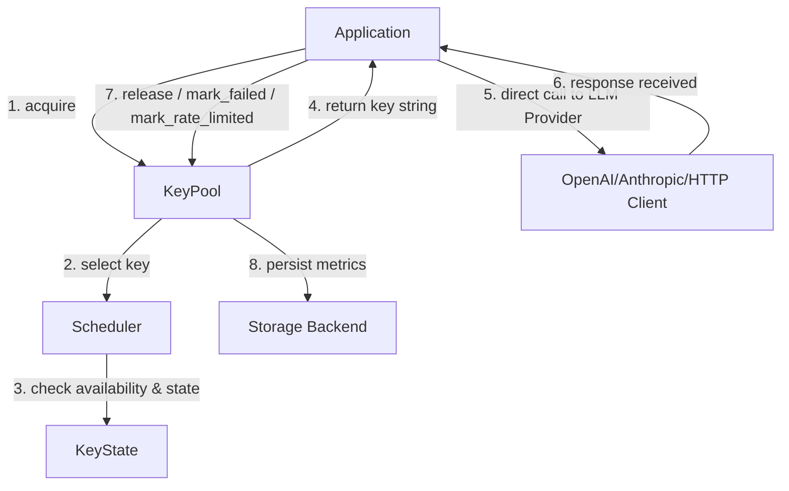

# KeyMesh Integration & Gemini Context Guide

This document provides specialized architectural context, guidelines, and runtime assumptions for **Gemini** (and other advanced LLMs) when interacting with, maintaining, or extending the **KeyMesh** workspace.

---

## 🚀 KeyMesh at a Glance

KeyMesh is a **lightweight, concurrency-safe credential orchestration runtime for AI API systems**. It acts purely as a credential pool manager and scheduler to multiplex multiple API keys across highly concurrent workloads, maximizing aggregate throughput (e.g., combining multiple lower-tier rate-limited keys to act as one high-throughput pool).

> [!IMPORTANT]
> **Strict Architectural Boundaries:**
> - **KeyMesh is ONLY:** A credential allocator, cooldown manager, state tracker, concurrency coordinator, and routing scheduler.
> - **KeyMesh is NOT:** An SDK wrapper, an HTTP gateway, a proxy server, an inference runner, or a transport framework.
> - **Zero Couplings:** KeyMesh must remain completely framework-agnostic. It does not wrap `openai`, `anthropic`, `httpx`, or any specific client. It only yields keys and records the outcome of operations.

---

## 🔄 Runtime Flow & Architecture

KeyMesh coordinates credentials via a simple, high-performance async-safe flow:



### Core API Usage

```python
from keymesh import KeyPool, SchedulerStrategy

# 1. Initialize the pool with raw API keys
pool = KeyPool(
    keys=["sk-key-1", "sk-key-2", "sk-key-3"],
    strategy=SchedulerStrategy.LEAST_BUSY
)

# 2. Acquire a credential (non-blocking scheduler selection)
key = await pool.acquire()

try:
    # 3. Use the key in any standard SDK or client directly
    # (KeyMesh does not intercept the HTTP call itself)
    response = await client.completions.create(api_key=key, ...)
    
    # 4. Release key back to the pool on success
    await pool.release(key, latency=response.elapsed)
    
except RateLimitError:
    # 5. Handle rate limits with cooldowns
    await pool.mark_rate_limited(key, cooldown=60.0)
    
except Exception:
    # 6. Track consecutive failures to prune dead keys
    await pool.mark_failed(key)
```

---

## 🛠️ Codebase Structure

```text
keymesh/
├── concurrency/     # Async-safe semaphores and concurrency locks
│   └── semaphores.py
├── cooldown/        # Cooldown management and state checks
│   └── manager.py
├── metrics/         # Pool-level diagnostic counters and statistics
│   └── pool_metrics.py
├── pool/            # Main KeyPool lifecycle and public API orchestrator
│   ├── pool.py      # Async KeyPool implementation
│   └── sync_pool.py # Synchronous/Threaded KeyPool implementation
├── scheduler/       # Pluggable scheduling strategies (Round Robin, Least Busy, Weighted)
│   ├── base.py
│   ├── least_busy.py
│   ├── round_robin.py
│   └── weighted.py
├── state/           # Runtime state representation
│   ├── key_state.py      # Async-safe individual KeyState
│   └── sync_key_state.py # Thread-safe individual SyncKeyState
├── storage/         # Pluggable persistence backends
│   ├── base.py           # Async storage base
│   ├── sync_base.py      # Sync storage base
│   ├── memory.py         # Async MemoryStorage
│   ├── sync_memory.py    # Sync SyncMemoryStorage
│   ├── json_storage.py   # Async JSONStorage
│   └── sync_json.py      # Sync SyncJSONStorage
└── utils/           # Utilities (logging, masking, helper decorators)
    └── helpers.py
```

---

## 💾 State & Persistence Model

Each credential tracks its own runtime diagnostics in an async-safe dataclass:

| State Field | Type | Description |
| :--- | :--- | :--- |
| `active_requests` | `int` | Number of concurrent tasks using this key |
| `cooldown_until` | `float` | Monotonic time when cooldown expires |
| `success_count` | `int` | Cumulative successful API calls |
| `failure_count` | `int` | Consecutive failure count (resets on success) |
| `latency_avg` | `float` | Exponential Moving Average (EMA) of response latency |
| `last_used` | `float` | Monotonic timestamp of the last acquisition |

### Backends

- **MemoryStorage**: Default, fast, thread-safe, single-process.
- **JSONStorage**: File-based persistence using atomic temp-file replacement.
- **SQLite / Redis Storage** *(Future/Pluggable)*: For multi-process or distributed runtimes.

---

## 🧬 Concurrency & State Invariants

1. **State Mutation Locks:**
   - **Async (`KeyState`):** All mutations on `KeyState` must acquire the inner `asyncio.Lock` via `async with self._lock:`.
   - **Sync (`SyncKeyState`):** All mutations on `SyncKeyState` must acquire the inner `threading.Lock` via `with self._lock:`.
2. **Stateless Schedulers:** Schedulers (`BaseScheduler` subclasses) are stateless selectors. They must only select a key and **never** mutate any key states directly.
3. **No Event Loop Blocking:** Do not block the event loop or introduce long sleeps when a key is rate-limited. Schedulers must dynamically skip keys cooling down/exhausted and return another immediately.
4. **EMA calculations:** Latencies must be smoothed using Exponential Moving Average (EMA) with a default alpha of `0.2`:
   $$\text{Latency}_{\text{avg}} = \alpha \cdot \text{Latency}_{\text{new}} + (1 - \alpha) \cdot \text{Latency}_{\text{prev}}$$

---

## 🔄 Concurrency-Safe Integration Patterns

When using KeyMesh with SDKs (like OpenAI or Anthropic), **never** recreate the client on every request and **never** mutate `client.api_key` globally (causes race conditions). Use one of these three concurrency-safe patterns:

### Pattern 1: Request-Scoped Client Overrides (`with_options`)
*Recommended for modern OpenAI SDKs.* Generates a copy of the client configuration pointing to the new key, while sharing the underlying connection pool.
```python
# Async
scoped_client = client.with_options(api_key=key)
response = await scoped_client.chat.completions.create(...)

# Sync
scoped_client = client.with_options(api_key=key)
response = scoped_client.chat.completions.create(...)
```

### Pattern 2: Per-Request Custom Headers (`extra_headers`)
Injects the authorization key directly inside the request header without changing client-wide configurations.
```python
response = await client.chat.completions.create(
    model="gpt-4",
    messages=[{"role": "user", "content": "Query"}],
    extra_headers={"Authorization": f"Bearer {key}"}
)
```

### Pattern 3: Automated Lifecycle Context Managers (`key_lifecycle`)
Encapsulates acquiring, releasing, timing, and error state tracking into reusable Python context managers to prevent key leaks.
```python
@contextlib.asynccontextmanager
async def key_lifecycle(pool: KeyPool):
    key = await pool.acquire()
    start = time.monotonic()
    try:
        yield key
        await pool.release(key, latency=time.monotonic() - start)
    except Exception:
        await pool.mark_failed(key)
        raise
```

---

## 🛠️ Tooling & Command Cheat Sheet

We use **`uv`** as the default package and project manager.

- **Run Tests:**
  ```bash
  uv run pytest
  ```
- **Type Checking (Strict mypy):**
  ```bash
  uv run mypy .
  ```
- **Linting & Formatting:**
  ```bash
  uv run ruff check .
  ```
- **Local Environment Cache Setup:**
  ```bash
  export UV_CACHE_DIR=.uv-cache
  ```

---

## 💡 Developer / AI Guidelines

- **Clean Interface:** Keep the public interface of `KeyPool` and `SyncKeyPool` clean. Only expose `acquire`, `release`, `mark_failed`, and `mark_rate_limited`. Do not introduce framework-specific transport wrappers.
- **Strict Typing:** Every function parameter, return value, and class field must be fully typed. Use strict `mypy` style annotations.
- **Error Propagation:** Do not let internal exceptions leak directly without being wrapped in subclasses of `KeyMeshError`.
- **Zero Heavy Dependencies:** KeyMesh must remain lightweight. Do not import heavy frameworks (like FastAPI, Flask, or HTTP gateways).
