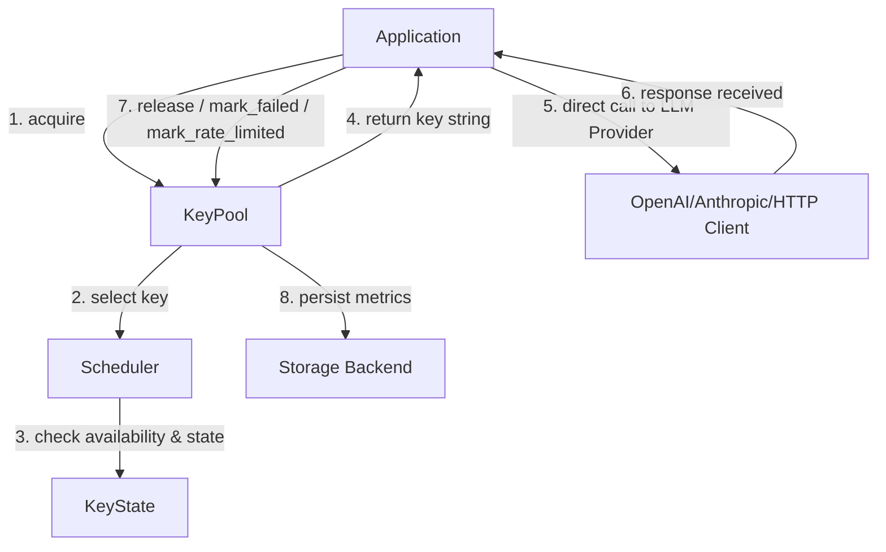

# KeyMesh Integration & Gemini Context Guide

This document provides specialized architectural context, guidelines, and runtime assumptions for **Gemini** (and other advanced LLMs) when interacting with, maintaining, or extending the **KeyMesh** workspace.

---

## 🚀 KeyMesh at a Glance

KeyMesh is a **lightweight, concurrency-safe credential orchestration runtime for AI API systems**. It acts purely as a credential pool manager and scheduler to multiplex multiple API keys across highly concurrent workloads, maximizing aggregate throughput (e.g., combining multiple lower-tier rate-limited keys to act as one high-throughput pool).

> [!IMPORTANT]
> **Strict Architectural Boundaries:**
> - **KeyMesh is ONLY:** A credential allocator, cooldown manager, state tracker, concurrency coordinator, and routing scheduler.
> - **KeyMesh is NOT:** An SDK wrapper, an HTTP gateway, a proxy server, an inference runner, or a transport framework.
> - **Zero Couplings:** KeyMesh must remain completely framework-agnostic. It does not wrap `openai`, `anthropic`, `httpx`, or any specific client. It only yields keys and records the outcome of operations.

---

## 🔄 Runtime Flow & Architecture

KeyMesh coordinates credentials via a simple, high-performance async-safe flow:



### Core API Usage

```python
from keymesh import KeyPool, SchedulerStrategy

# 1. Initialize the pool with raw API keys
pool = KeyPool(
    keys=["sk-key-1", "sk-key-2", "sk-key-3"],
    strategy=SchedulerStrategy.LEAST_BUSY
)

# 2. Acquire a credential (non-blocking scheduler selection)
key = await pool.acquire()

try:
    # 3. Use the key in any standard SDK or client directly
    # (KeyMesh does not intercept the HTTP call itself)
    response = await client.completions.create(api_key=key, ...)
    
    # 4. Release key back to the pool on success
    await pool.release(key, latency=response.elapsed)
    
except RateLimitError:
    # 5. Handle rate limits with cooldowns
    await pool.mark_rate_limited(key, cooldown=60.0)
    
except Exception:
    # 6. Track consecutive failures to prune dead keys
    await pool.mark_failed(key)
```

---

## 🛠️ Codebase Structure

```text
keymesh/
├── concurrency/     # Async-safe semaphores and concurrency locks
│   └── semaphores.py
├── cooldown/        # Cooldown management and state checks
│   └── manager.py
├── metrics/         # Pool-level diagnostic counters and statistics
│   └── pool_metrics.py
├── pool/            # Main KeyPool lifecycle and public API orchestrator
│   └── pool.py
├── scheduler/       # Pluggable scheduling strategies (Round Robin, Least Busy, Weighted)
│   ├── base.py
│   ├── least_busy.py
│   ├── round_robin.py
│   └── weighted.py
├── state/           # Async-safe individual key state representation
│   └── key_state.py
├── storage/         # Pluggable persistence backends (Memory, JSON, SQLite, Redis)
│   ├── base.py
│   ├── json_storage.py
│   └── memory.py
└── utils/           # Utilities (logging, masking, helper decorators)
    └── helpers.py
```

---

## 💾 State & Persistence Model

Each credential tracks its own runtime diagnostics in an async-safe dataclass:

| State Field | Type | Description |
| :--- | :--- | :--- |
| `active_requests` | `int` | Number of concurrent tasks using this key |
| `cooldown_until` | `float` | Monotonic time when cooldown expires |
| `success_count` | `int` | Cumulative successful API calls |
| `failure_count` | `int` | Consecutive failure count (resets on success) |
| `latency_avg` | `float` | Exponential Moving Average (EMA) of response latency |
| `last_used` | `float` | Monotonic timestamp of the last acquisition |

### Backends

- **MemoryStorage**: Default, fast, thread-safe, single-process.
- **JSONStorage**: File-based persistence using atomic temp-file replacement.
- **SQLite / Redis Storage** *(Future/Pluggable)*: For multi-process or distributed runtimes.

---

## 💡 Guidelines for Gemini Tasks

When modifying or answering questions about KeyMesh, observe the following:

1. **Maintain Concurrency Safety**: All mutations on `KeyState` must acquire the inner `asyncio.Lock` via `async with self._lock:`.
2. **Never Sleep During Cooldowns**: Do not block the event loop or introduce long sleeps when a key is rate-limited. Schedulers must dynamically skip keys cooling down and return another immediately.
3. **Keep Interface Clean**: The public interface of `KeyPool` must only expose `acquire`, `release`, `mark_failed`, and `mark_rate_limited`. Do not introduce framework-specific transport wrappers.
4. **Leverage local `uv` toolchain**: Package management is handled exclusively via `uv`.
